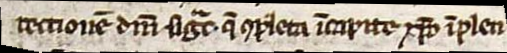
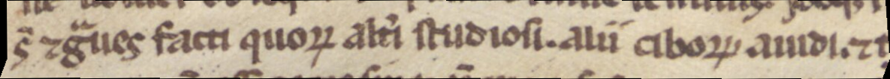
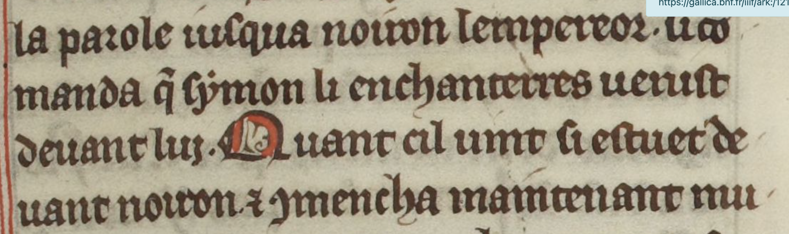

## CATMuS Guidelines Presentation

The CATMuS guidelines aim to propose a systematic approach to transcription in the context of creating training data for automatic text recognition (ATR)[^1]. Our task is to find a way to translate how a text is rendered on its original medium into a machine-readable system that facilitates learning.

Our solutions will inevitably be reductive, as it is impossible to fully capture the diversity of handwriting using the limited character set available to a computer and the necessity of simplication due to the production of a generic model and the need for those rules to be accessible to non paleograph experts. The proposed rules must strike a balance between principles suited for machine learning and a palaeographic approach. They must also adhere to a principle of simplicity (as much as possible), since producing this kind of data is fundamentally a collective effort. Therefore, we must establish the simplest common ground in our practice. For any specific corpus, CATMuS guidelines can be adapted, specify, e.g if your corpus need a distinction between `<macron>` and `<tilde>` (that have been rendered with the same sign (tilde) in our corpus), as it is significant in your corpus, then if consistent it can be later converted to be compatible wiht catmus guidelines, if you want to integrated your corpus in it. 

Finally, it is essential to emphasize that adhering to the guidelines is the best way to ensure compatibility between datasets. In order to facilitate access to special characters and ensure consistent character use, we provide JSON keyboard layouts that can be uploaded to eScriptorium through the Tools and Keyboard section. The keybord is devided into three : special caracter, combining sign (sign above a letter), suscript sign ( like exposant, eg. 9)

## Graphemic transcription principles

To define our approach, we follow the definitions of graphemic transcription provided by Peter Robinson and Elisabeth Solopova[^2] — a transcription method that preserves the sequence of letters and abbreviations while reducing each form to its representation within an alphabetic system.

To ensure an accessible transcription system, we rejected the idea of producing fully imitative transcriptions that capture every variation in the shape of alphabetic letters (e.g., different forms of a, d, e, r, s, etc.), as it would be impossible to establish general transcription guidelines for all medieval documents from the 10th to the 15th centuries. Pushing imitation too far would risk making transcription both impractical and unusable[^3]. For this reason, we chose to adopt the principles of graphemic transcription.

This approach is particularly challenging for abbreviations, as the boundary between a different shape of a sign and a distinct sign is often unclear and sometimes subjective. For example, in 13th-century French manuscripts, tildes and macrons are frequently interchangeable, though this is not always the case with other types of documents. That's why we use the same sign < ̃> for both. At present, the list of signs is not fixed; it may be expanded as new case studies emerge. Even if imperfect, we aim to adhere to two criteria for abbreviations to regroup potential variation of the same sign:
- Shape of the sign
- Potential function(s) of the sign

Our goal is to strike a balance and avoid unnecessarily multiplying the number of distinct signs, ensuring they are both recognizable and sufficiently represented in the dataset. A second argument is that multiplying the number of signs can be confusing for transcribers from different backgrounds. For example, in the CATMuS guidelines, the transcription of a flattened superscript open a can be ambiguous, as it visually resembles a tilde. Some transcribe it as a tilde (since it visually resembles one), while others transcribe it as a superscript open a < ᷓ>. The choice of this specific sign is recent: it was previously transcribed with a superscript < a > as an allograph, but since some extensions of the abbreviation have lost the sense that it originally stood for an <a>, we chose to stick to the form and use a specific sign instead.

Some examples of macrons, tildes and flattened open a:

| Graz, Universitätsbibliothek, Ms. 1265, 13th c.| Transcription |
|---|---|
|  | rectionẽ dñi sigᷓr. q̃ ꝯpleta ĩ capite xp̃o ĩplen |
| Graz, Universitätsbibliothek, Ms. 1265, 13th c.| Transcription |
|  | ĩcipit oẽ opꝰ miᷓtoriũ. s imꝑfecte dt᷑ post psalm̃ |
| Munich, BayerischeStaatsbibliothek, CLM 13027, 13th c. | Transcription |
|  |  s̃ ⁊gᷓues facti quoꝵ alt̾i studiosi. alii ciboꝵ auidi ⁊t  |

However, when examining the CATMuS data, it is important to consider that: some norms have evolved over time, such as the representation of letters with strokes, which were initially treated as letters combined with a stroke. Specific signs for these cases have since been introduced in the guidelines (see Table of Special Characters). Tools like Choco-Mufin exist to harmonize, verify and document the characters used in transcriptions[^4].

Finally, one of the project’s objectives is to establish a consultative board made of expert from different background with annual meetings to address specific cases or the addition of new signs to the datasets. Tricky cases will also be discussed in a FAQ to keep the guidelines as simple and systematic as possible, while still addressing the non-standardized reality of manuscripts.

NB: The transcription should only take into account characters and signs that are part of the body text. Consequently, decorative elements such as line-ending ornaments should not be transcribed.

## Favoring Unicode's public domain

Regarding character selection, Unicode’s public domain should be preferred over various private domains (known as [Private Use Areas](https://en.wikipedia.org/wiki/Private_Use_Areas)). For specialized characters, such as abbreviations or textual structuring signs, we have followed the MUFI guidelines, prioritizing characters available in the public domain. If a private-use character is chosen, this decision must be clearly documented in the project's guidelines.

## Exemple

| BnF, Département des manuscrits, fr. 412 | Transcription                                                                                                                                                                |
|--------|------------------------------------------------------------------------------------------------------------------------------------------------------------------------------|
| | la parole iusqua noiron lempereor. li co- manda q̃ symon li enchanterres uenist deuant lui. Quant cil uint si estuet de- uant noiron ⁊ ꝯmencha maintenant mu- |

------
## Notes

[^1]: This work is the result of a synthesis of textbooks written by Ariane Pinche: Ariane Pinche. "Guide de transcription pour les manuscrits du X^e au XVe siècle." 2022, [hal-03697382](https://hal.science/hal-03697382) and the work of Thibault Clérice, Malamatenia Vlachou-Efstathiou and Alix Chagué: "CREMMA Medii Aevi: Literary manuscript text recognition in Latin", Journal of Open Humanities Data, 2023, 9, pp.4, [10.5334/johd.97](https://dx.doi.org/10.5334/johd.97).

[^2]: Robinson, Peter, et Elizabeth Solopova. « Guidelines for Transcription of the Manuscripts of the Wife of Bath’s Prologue ». In The Canterbury Tales Project Occasional Papers, 19‑52, 1993, doi: [10.5281/zenodo.4050360](https://doi.org/10.5281/zenodo.4050360).

[^3]: As noted by Robinson and Solopova, when attempting to create imitative transcriptions, transcribers who focused too much on variations in letter shapes began making significant transcription errors that altered the meaning of the text.

[^4]: Clérice, T., & Pinche, A. (2021). Choco-Mufin, a tool for controlling characters used in OCR and HTR projects (Version 0.0.4) [Computer software]. https://doi.org/10.5281/zenodo.5356154]

