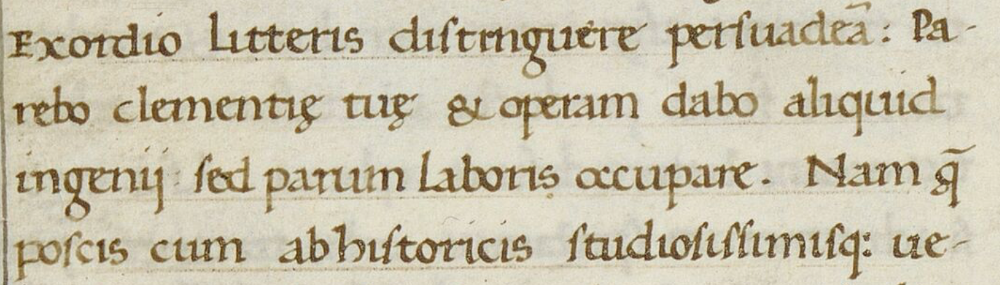
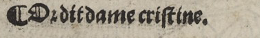
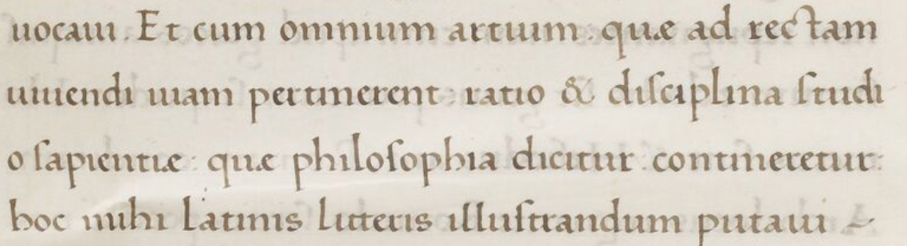
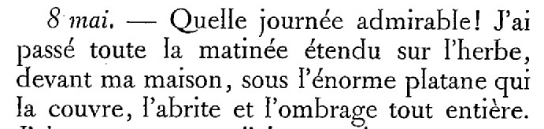
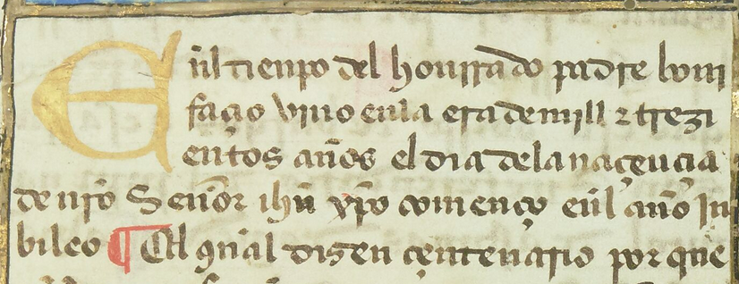
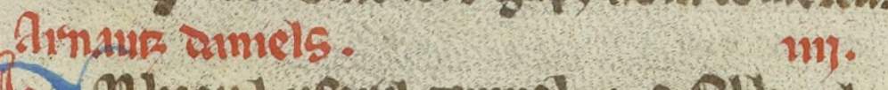
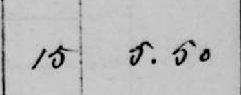

## Transcription of Alphabetic and Numerical Signs

Since alphabet compositions and letterform variations are not consistent over time, some letters having emerged (such as w) while others tended to disappear (such as *ſ* and *ƞ*), we aimed to find a balanced approach between faithful rendering of the source and feasibility and reproducibility of the method across a broad scientific community.

### General Principles
**The transcription of alphabetic and numerical signs MUST follow the modern Latin alphabet.**
*This ensures consistency and readability, as historical variations in letter shapes are too numerous and complex to classify systematically.*

- Alphabetic signs **MUST** be transcribed using the modern Latin alphabet.
- Capital letters **MUST** be preserved.
- Small caps **MUST** be rendered as uppercase letters.
  *Small caps are stylistic variations, not distinct characters, so they are normalized to uppercase for simplicity.*
- Stylistic elements (e.g., italics, bold) **MUST NOT** be transcribed.
  *These do not involve distinct characters.*

**Core Rule**: The transcription **MUST** follow the letters as they appear in the source, with **NO** editorial corrections.
*This preserves the source text, which is critical for historical and linguistic analysis.* 

|BnF, Département des manuscrits, Smith-Lesouëf 22                                  | Transcription                                                                                                                                                                        |
|--------------------------------------------|--------------------------------------------------------------------------------------------------------------------------------------------------------------------------------------|
|  | Exordio litteris distinguere persuadeã: Pa- rebo clementiȩ tuȩ & operam dabo aliquid ingenii: sed parum laboris occupare. Nam  ̧q̃ poscis cum ab historicis studiosissimisq: ue-  |

## Ligatures

As ligatures represent graphical variations combining two letters into a single form, ligatures MUST be transcribed as separate letters.

In **medieval documents**, the ampersand (`&` [U+0026]) **MUST** be transcribed as is. This is based on the fact that this sign can bear additional abbreviation marks, such as macrons to indicate "etiam" in Latin.

In **modern and contemporary** documents, both "&" [U+0026] and "ß" [U+00DF] **MUST** be transcribed as is.

| BnF, Département Réserve des livres rares, RES-Y2-746            | Transcription         |
|------------------------------------------------------------------|-----------------------|
|  | ¶Or dit dame cristine. |

## Ramist letters ("u"/"v", "i"/"j")

### In medieval documents

In **medieval documents**, since the use of these signs does not distinguish between vocalic and consonantal uses, ramist letters are purely allographic variations. Therefore, Ramist letters (`u`/`v`, `i`/`j`) **MUST** be transcribed as `i` and `u`, respectively. 

| BnF, Département des manuscrits, Latin, 6                              | Transcription                                                                                                                                                                                  |
|------------------------------------------------|------------------------------------------------------------------------------------------------------------------------------------------------------------------------------------------------|
|  | uocaui. Et cum omnium artium quȩ ad rectam uiuendi uiam pertinerent ratio & disciplina studi o sapientiae quae philosophia dicitur contineretur hoc mihi latinis litteris illustrandum putaui |

### In modern and contemporary documents

In **modern and contemporary documents**, the transcription **MUST** follow modern usage (e.g., `v` for consonantal, `u` for vocalic).

In **printed sources**, the transcription **MUST** follow the printer’s usage.
*Printers’ conventions may differ, and respecting them ensures fidelity to the source.*

| BnF, Département Littérature et art, 8-Z-18097                       | Transcription                                                                                                                                                                                                                                                                                                             |
|----------------------------------------------------------------------|---------------------------------------------------------------------------------------------------------------------------------------------------------------------------------------------------------------------------------------------------------------------------------------------------------------------------|
|  | 8 mai. -- Quelle journée admirable ! J'ai passé toute la matinée étendu sur l'herbe, devant la maison, sous l'énorme platane qui la couvre, l'abrite et l'ombrage tout entière.  |

## Capital letters

Lowercase letters **MUST NOT** be normalized to uppercase.

If the distinction between uppercase and lowercase is unclear, the transcription **MUST** remain consistent.

| BnF,Département des manuscrits, Espagnol 36 | Transcription                                                                                                                                                                             |
|-----------------|-------------------------------------------------------------------------------------------------------------------------------------------------------------------------------------------|
|                 | ñl tienpo del honrrado padre boni façio uino enla era de mill ⁊ trezi entos años el dia dela naçençia de nr̃o Señor ihũ xp̃o començo eñl año iu bileo ¶ Etl gñal dizen çentenario por que |

Series of capital letters or emphasized letters, such as the one found in running title, **MAY** be transcribed as series of capital letter, depending on their inner variation.

Drop capitals and decorated letters **MUST** be transcribed as uppercase. and MUST be considered as not a part of the same text line as the line they semantically belong to: they should be identified as drop capitals during the image segmentation phase. *Drop capitals often misalign with the baseline, so treating them separately avoids segmentation errors.*

Oversized capitals expanding above the baseline, particularly at the beginning of paragraphs, **MUST** be transcribed, even if part of the letter is missing in the mask's polygon.

## Digits and numerals

### General Rules for Numerals
Numbers **MUST** be transcribed as they appear in the document, whether as Roman or Arabic numerals.
*This preserves the original format, which may be significant for historical or stylistic analysis.*

- For Roman numerals, ramist standardization (u, v, i, j) **MAY** be applied following the rules specified above.
- Numbers written with superscript letters **MUST** follow the rules specified in the section dedicated to superscript [abbreviations](./abbreviations.html).
- The groups of numbers **MUST** be clearly separated, and the punctuation around the number **MUST** be retained where it exists.

In **modern and contemporary documents**, when the distinction between a capital I and a 1 is difficult to make (as can be the case in typewritten documents or in some manuscripts), we **MAY** follow the transcription that makes the most sense in the source.

[Old-style roman numerals](https://textcreationpartnership.org/docs/dox/rnums.html) M and D (sometimes transcribed as "CIↃ" and "IↃ") MUST be transcribed as, respectively, M and D.

In modern documents, decimals **MUST** follow the convention used in the document (`,` or `.`). In case of a doubt, we recommend sticking to the system used more commonly in the rest of the document. If the source uses a symbol or a space to separate thousands, we should follow the report it in the transcription.

| BnF, Département des manuscrits, fr. 654                                                       | Transcription                         |
|-------------------------------------------------------------------|---------------------------------------|
|                          | Arnautz daniels.               .iiii. |
| Lectaurep, fonds Dufour, DAFANCH96_048MIC07650_L-0                | Transcription                         |
|  | 15.         5.50                      |

