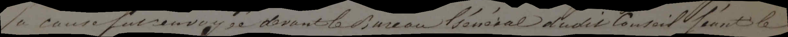
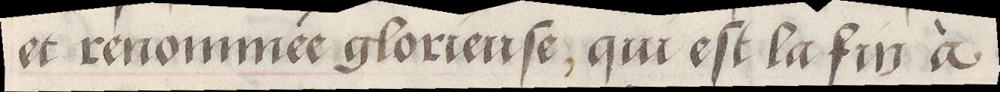
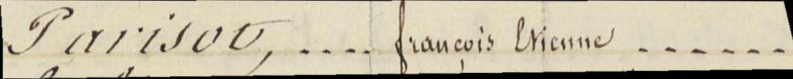
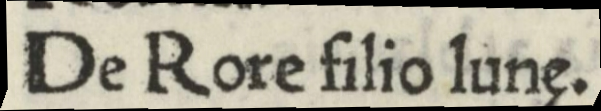

## Accents

### Modern and Contemporary Documents
Accents **MUST** be transcribed whenever they appear in the source..

| Paris, AD75, D1U10 386, 19^th c.              | Transcription                           |
|--------------------------------------------|-----------------------------------------|
| |  la cause fut renvoyé devant le Bureau Général du dit Conseil séant le |

In medieval documents, accents are relatively marginal and SHOULD be transcribed when they occur. **Be careful: pointed *i* MUST NOT be transcribed with an acute accent, but simply as a regular *i*.**

|Paris, BnF, Arsenal, 5103, 15th c.        | Transcription                    |
|--------------------------------------------------|-----------------------------------------|
|  | et renommée glorieuse, qui est la fin à   |

### Medieval Documents

Accents are relatively marginal in medieval documents and **SHOULD **be transcribed when they occur.

#### Special Cases
- When an accent is misaligned with the letter it belongs to—often the case in cursive writing—the accent **MUST** be transcribed in its expected position, rather than at the place where it was physically drawn.
- When the orientation of an accent is uncertain (e.g., a flat horizontal stroke above a letter), modern accentuation **should** be followed in modern document.
    - In 16th-century documents, the acute accent MAY be preferred.

Automatic baseline or polygon detection may exclude an accent traced too far above the line. In such cases, the accent **MAY** nonetheless be transcribed as if it were included within the polygon, anticipating technological improvements that will ensure better inclusion of such marks in future line masks.

## Cedillas

### General Rule

Cedillas **MUST** be transcribed using the combining cedilla [U+0327].

|Paris, AN, MC/CM - Projet Lectaurep, 19^th c.                             | Transcription                           |
|--------------------------------------------------|-----------------------------------------|
|  | Parisot, ---- françois Etienne -----  |

NB: In Latin manuscripts from the 10th to the 13th centuries, cedilla-marked e’s frequently represent the Latin diphthong ae. Cedillas **MUST** therefore be transcribed in medieval French manuscripts as well, in order to ensure consistent encoding.

 
| Paris, Mazarine, Inc. 59, 15^th c.   | Transcription       |
|-----------------------------|---------------------|
|                  | De Rore filio lunȩ.|

 
