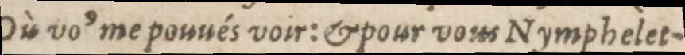
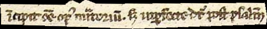
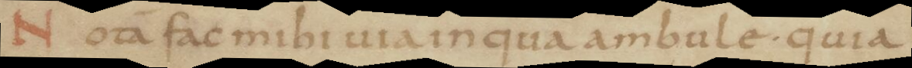
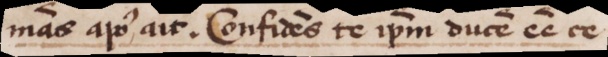
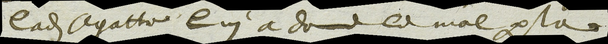

# Abbreviations 

## General Rule
Abbreviations **MUST** be reproduced and **MUST NOT** be expanded in the transcription.
*Expanding abbreviations at the transcription stage—where automated tools lack contextual and linguistic information **MUST** be avoided, as it risks introducing inconsistencies and degrading model performance. We therefore consider that abbreviation expansion **SHOULD** be treated as a separate normalization task, performed after the transcription stage.*

| Paris, BnF, YE-7580, 17th c.| Transcription |
|---|---|
|  | Où voꝰ me pouués voir: & pour vous Nymphelet-  |
| Graz, Universitätsbibliothek, Ms. 1265, 13th c. | Transcription |
|  |  ĩcipit oẽ opꝰ miᷓtoriũ. s imꝑfecte dt᷑ post psalm̃ |

## Medieval Documents

### Character Selection
**For medieval documents, [MUFI](https://mufi.info/q.php?p=mufi/home) characters MUST be preferred, along with Unicode's public domain characters.**
*The use of standardized characters ensures interoperability and consistency across projects.*
- The **semantic value** of the unicode sign **MUST** be taken into account.
  *For example, to represent "p with stroke," the Armenian letter ք (Ke) [U+0554] **MUST NOT** be used, even if it visually resembles ꝑ [U+A751], which is the correct character carrying the appropriate semantic value for "p with stroke through the descender."*

When selecting the appropriate MUFI character, the choice **MUST** be based on the **shape** of the abbreviation, keeping in mind that CATMuS does not differentiate allographs. If the shape leads to an uncertain choice, the choice **MAY** be informed by the **function** of the abbreviation sign.

Projects following CATMuS guidelines **MUST** prioritize the characters listed in the [CATMuS character table](html/guidelines/en/8_character_table.html).

#### Categories of Abbreviations
Abbreviations in medieval documents fall into the following categories:
- **Tildes**
- **Abbreviations using special signs**
- **Abbreviations using superscript letters**
  *Superscript letters are divided into two subcategories:*
  - **Combining characters**: Letters written directly above another letter, see keyboard in section [Tools](html/guidelines/en/9_tools.html).
  - **Superscript characters**: Letters written in superscript position next to a regular letter (e.g., exponent-like forms),see keyboard in section [Tools](html/guidelines/en/9_tools.html).

We provide a priority list of signs in the table below. Given the diversity of abbreviation representations across time and languages, we make no claim to exhaustivity. See also the subsection on *Graphemic Transcription Principles* in the [Generalities section](html/guidelines/en/1_generalites.html).

Concerning the placement of the tilde, some cases may seem complex, and certain choices are more influenced by habit than by strict rules.
In instances where the tilde covers more than one element, there are two possible approaches, depending on the context:
- Double the sign, as in ẽẽ (esse).
- Place the sign in the most appropriate position—either in the middle of the word, or over the consonant or vowel that is modified.

| Paris, BnF, lat. 13388, 9th c.| Transcription |
|---|---|
|  | Notã fac mihi uia in qua ambule. quia   |
| Toronto, Thomas Fisher Rare Book Library, MSS 01237, 15th c. | Transcription |
|  |  ma᷑s apoꝰ ait. Confidẽs te ip̃m ducẽ ẽẽ ce |

---
## Modern and Contemporary Documents

### General Approach
For older documents where the abbreviation system resembles medieval practices, **the rules for medieval documents MAY apply.** *This allows for consistency when dealing with transitional or hybrid systems.*

For commonly abbreviated letters (e.g., "ꝑ" [U+A751], "⁊" [U+204A], "&" [U+0026]),"ɖ" [U+0256]), they **MAY** be retained for the transcription of more recent sources.

| Bâle, Staatsarchiv Basel-Stadt, B 168/15-9.2, 17^th c                           | Transcription                           |
|--------------------------------------------------|-----------------------------------------|
|  | laɖ Agatte lui a donne le mal ꝑ la  |

### Superscript Letters
In modern and contemporary documents, abbreviations often take the form of superscripted letters (e.g., "1ˢᵗ" for *first*, "Mᵉˡˡᵉ" for *Mademoiselle*). The following rules **MUST** be applied :

1. Superscript sequential additions must be transcribed with superscript caracters, see keyboard in section [Tools](html/guidelines/en/9_tools.html). *P.S : Superscript sequential additions have been transcribed in the first datasets using a pseudo markup system based on "^" [U+005E], which marks the beginning of the sequence.*

3. Interlinear corrections **MUST NOT** be confused with superscript sequential additions. If a superscript sequence forms a complete word or a sequence of words, it **MUST** be transcribed on its own line.

4. In modern documents, a unique letter used above a word, as it can be found in medieval documents, **SHOULD** be transcribed with the corresponding combining letter, combined to the character it relates to.
