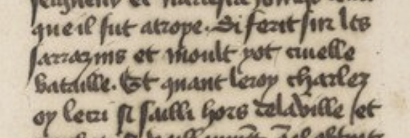
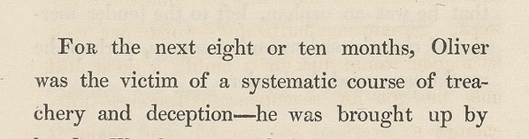
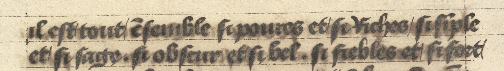

## Word Segmentation

Word segmentation **MUST** be transcribed as closely as possible to the source, without normalization.

However, the medieval period marks a transition from *scripta continua* (continuous script without spaces) to the use of typographic spaces between words, a practice fully established only with the advent of print technology. Word separation in medieval manuscripts—and sometimes in manuscripts more generally—is therefore **not standardized**, making it inherently complex.[^1].  

In a given document, word division can be highly subjective, and two transcribers may interpret it differently. When it is impossible to determine whether a space is present or not, the irregularity of spacing in manuscripts has led to the following rule: **When unclear, word segmentation SHOULD follow modernized conventions to ensure consistency, using the typographic space** (" " [U+0020]). However, some exceptions apply due to the medieval nature of some documents and their linguistic state, which are described below in the section *Exceptions and Special Cases*.

| source                                                       | transcription                                                                                                                                 |
|--------------------------------------------------------------|-----------------------------------------------------------------------------------------------------------------------------------------------|
|  |  que il fut atroye. Si ferit sur les sarrazins et moult yot cruelle bataille. Et quant leroy charlez oy le cri si sailli hors delauille et |

### Special Cases

- As the use of the apostrophe doesn't exist in medieval manuscrit, original agglutination **MUST** be kept, eg.`qil` for the normalized form `q'il`.
- The used of doubled consonants to note elision **MUST** be kept and not normalized, eg. `arriva` is kept instead of `á riva`. 
- **Locutions in the process of being lexicalized** (such as for verbs like `enchargier`/`en chargier`, `en fuir`/`enfuir`or certain locutions such as `aujourd'hui`) MUST be transcribed as they appeared in the source.
- The separation of the initial at the beginning of a verse in poetry **MUST** be imitated.
- In the case of a drop capital at the beginning of a line, it CAN either be ignored (as such letters are often more decorative than textual) or transcribed on a separate line. This is because the baseline of a drop capital typically does not align with the rest of the text, and line segmentation often fails to capture it as part of the continuous line.

When in doubt, word segmentation should follow the usage of the contemporary or normalized language of the manuscript.

## Hyphenation  

Hyphenation refers to the indication that a word has been split at the end of a line. While it appears inconsistently in medieval manuscripts, it is frequent in modern and contemporary sources.  
  
Hyphenation **MUST** be transcribed whenever it appears in the source.  

A hyphenation symbol **MUST NOT** be added if it is not present in the source.  

The character "-" [U+002D] **MUST** be used to transcribe the hyphenation symbol,  regardless of its form in the source.
If the hyphenation symbol is repeated at the beginning of the next line, it **MUST** also be transcribed as "-" [U+002D].  

| BnF,  département Littérature et art, Y2-27423             | Transcription                                                                                                                        |
|------------------------------------------------------------|--------------------------------------------------------------------------------------------------------------------------------------|
|  | For the next eight or ten months, Oliver  was the victim of a systematic course of trea-  chery and deception -- he was brought up by |

## Diastoles

Sometimes, diastoles (vertical or oblique pen strokes) are drawn between two contiguous letters to indicate that they belong to different words. Diastoles (vertical or oblique pen strokes) **MUST** be transcribed with the sign "/" [U+002F]. 

| University of Pennsylvania, ms. 660                    | Transcription                                                                                                 |
|--------------------------------------------------------|---------------------------------------------------------------------------------------------------------------|
|  | il est/tout/ẽsemble si poures et/si riches/si sĩple/ et/si sage. si obscur et/si bel. si fiebles et/si fort/ |

------
## Notes
[^1]: Paul Saenger, « La naissance de la coupure et de la séparation des mots », dans Henri-Jean Martin, Jean Vezin (éd.), *Mise en page et mise en texte du livre manuscrit*, Paris, France, 1990, p. 447‑455.

