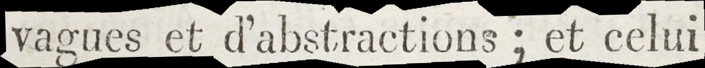
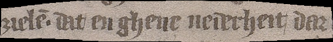
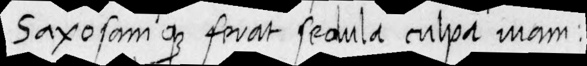
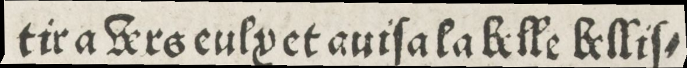
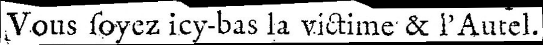

## Punctuation 

### General Rule
Punctuation in the source **MUST** be transcribed exactly as it appears in the document and **MUST NOT** be normalized. Spacing **MUST** be standardized as follows:
- No double spaces.
- No space before punctuation marks.
- A single space after punctuation marks, *except for quotation marks and apostrophes*.

| Paris, BnF, RESP-Y2-2462, 18th c.                             | Transcription                           |
|--------------------------------------------------|-----------------------------------------|
|  | vagues et d'abstractions; et celui  |

### Medieval Sources
Punctuation transcription in medieval sources **MUST** be simplified to ensure consistency.

Because the dot-based punctuation system displays a wide variety of shapes (simple dot, middle dot, punctus elevatus, double dot, colon, semicolon, etc.), and since their use frequently varies across scribes and manuscripts, the following simplification rules MUST be applied:

- *Single dot* **MUST** be transcribed as <.> [U+002E], regardless of its height or position.
- *Double dots* **MUST** be transcribed as <:> [U+003A].

| Ghent, UL, 941, 14th c.                        | Transcription                           |
|--------------------------------------------------|-----------------------------------------|
|  | zielẽ. dat/ en ghene nederheit/ dar|
| Paris, BnF, lat. 8236, 15th c.                         | Transcription                           |
|  | Saxosam q ferat sedula culpa uiam:     |

NB: This system *MAY* be adapted to the historical period and to the geographic or linguistic context. For example, the inverted question mark <¿> occurs in Spanish manuscripts, whereas the standard question mark <?> appears in Italian ones.
Any such adaptation *MUST* be explicitly documented and justified.

-  The sign </> [U+002F] **MUST** be used for diastoles and virgula suspensiva.
  *These signs often serve both token segmentation (e.g., words, verses) and indicating a short pause.*

| Paris, BnF, esp. 225 , 15-16th c.                                | Transcription                           |
|--------------------------------------------------|-----------------------------------------|
|  | De plants eplors/ tots estam molt fornits |

- At the end of a line, all hyphenation marks **MUST** be represented by the sign <-> [U+00AC].

| Paris, BnF, Rés. Y2-82, 15th c.                             | Transcription                           |
|--------------------------------------------------|-----------------------------------------|
|  | tira uers eulx et auisa la belle bellis- |

### Modern and Contemporary Sources
Punctuation marks in modern and contemporary sources **MUST** be transcribed exactly as they appear in the source. This includes periods, commas, exclamation marks, question marks, and similar signs, which **MUST** be represented faithfully. 

#### Standardization of Allographic Variations
Some graphical variations are considered allographic. In such cases, **the representation MUST be reduced to a single standardized sign**:
- **Dashes**:  All dashes, whether short or long,** MUST** be transcribed as <-> [U+2010].  *This avoids ambiguity and ensures consistency.*

- **Hyphenation at Line Breaks**: All hyphenation marks **MUST** be transcribed as <¬> [U+00AC] [U+2010].  *This avoids confusion with hyphens used for morphological or lexical associations (e.g., "semi-automatique").*

- **Quotation marks**: Any character functioning as a quotation marker **MUST** be transcribed as the standard Unicode quotation mark <"> [U+0022].

- **Apostrophes**: All apostrophe-like characters MUST be transcribed as the single quotation mark <'> [U+0027].

| Paris, BnF, YE-2650, 17th c.                          | Transcription                           |
|--------------------------------------------------|-----------------------------------------|
|  | Vous soyez icy-bas la victime & l'Autel.  |