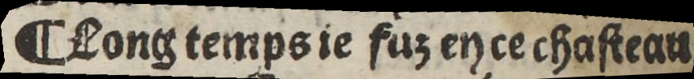
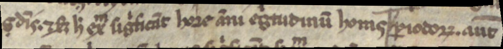
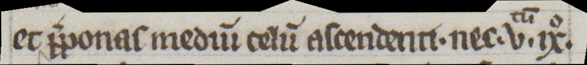
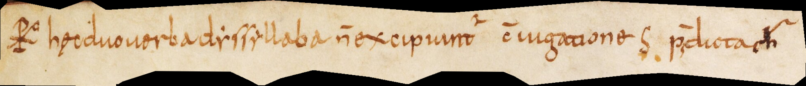
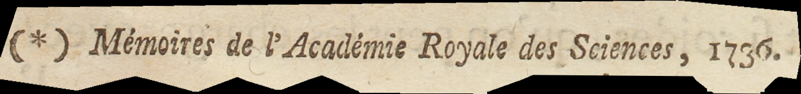
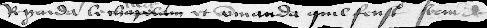
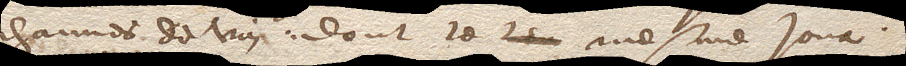
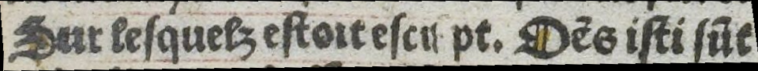

## Functional Marks

Historical documents often contain additional signs indicating textual organization or the status of certain passages. These signs **MUST** be transcribed as faithfully as possible.
*However, due to the extensive variety of such signs, certain standardization principles **MUST** be applied to ensure consistency and reproducibility.*

### Section marks

#### Medieval and Modern Documents
Section division symbols **MUST** be transcribed using the appropriate character.

- Pilcrows and similar symbols (reverse pilcrow, ornamental variants, etc.) **MUST** be transcribed as <¶> [U+00B6], regardless of orientation.
In **modern documents**, other signs **MUST** be transcribed as as faithfully as possible. In most of the cases, the standardized sign <§> [U+00A7] **SHOULD** be used to indicate sections or paragraphs.

| Paris, BnF, Rés. Y2-930, 15th c.                         |Transcription
|--------------------------------------------------|-----------------------------------------|
|  | ¶ Long temps ie fuz en ce chasteau |
| Munich, Bayerische Staatsbibliothek, CLM 13027, 13th c.                         |Transcription |
|  | s dĩs.⁊ ẜ ħ exͫ sigͥficãt hore ãni egͥtidinũ horas ¶ ꝑiodoꝵ. aũt |

### Reference Marks

#### Medieval Documents

- *Insertion* signs **MUST** be transcribed with the caret sign <‸> [U+2038].
- *Reference marks* (such as <*> [U+002A] or <※> [U+203B]) **MUST** be normalized to <*> [U+002A].
- *Manicules* **MUST** be transcribed as <☞> [U+261E].

If there is an interlinear addition, it **MUST** be considered a separate text line and transcribed accordingly using the SegmOnto vocabulary.

#### Modern and Contemporary Documents
Reference marks **MUST** be reproduced as they appear in the source. When in doubt, medieval norms SHOULD be applied.

|      Paris, BnF, lat. 16204, 13th c.       |Transcription
|--------------------------------------------------|-----------------------------------------|
|  | et ‸p̃ponas mediũ celũ ascendenti. nec .uͭ ͧ̃.ixͦ.  |
| Bamberg, Staatsbibliothek, MS Class. 30, 9th c.                         |Transcription |
|  | * hȩc duo uerba dysyllaba ñ excipunt᷑ c̃iugationes S p̃dicta * |
| Paris, BnF, 4-S-1534, 18th c.                    | Transcription                                          |
|   | (*) Mémoires de l'Académie Royale des Sciences, 1736.  |

### Correction marks

For in-line corrections, the combination <⟦> [U+27E6] and <⟧>s [U+27E7] **MUST** be used to encapsulate a word marked as crossed out. If the word is not decipherable, as many dots as the number of missing letters **MAY** be added. 

If the word is not decipherable (due to a stain, strokes, or any other reason), the combination <[> [U+005B] and <]> [U+005D] **MUST** be used empty, optionally adding as many dots as the presumed number of missing letters.

|     Paris, BnF, fr. 12554, 15th c.       |Transcription
|--------------------------------------------------|-----------------------------------------|
|  | Regarda le ⟦chapelain⟧ et cõmanda quil feust serui |
|    Bâle, Staatsarchiv Basel-Stadt,  B 168/15-2.2, 17th c.      |Transcription |
|| channes de vin. dont le ⟦lieu⟧ mesme Jour. |

### Unreadable text

If the text is unreadable due to damage to the support (and not because of a correction), the combination <[> [U+005B] and <]> [U+005D] **MUST** be used to encapsulate the unreadable portion, optionally adding as many dots as the number of missing letters.

|    Paris, BnF, Velins 1103, 16th c.       |Transcription
|--------------------------------------------------|-----------------------------------------|
|  | Sur lesquelz estoit escr[]pt. Dẽs isti sũt |